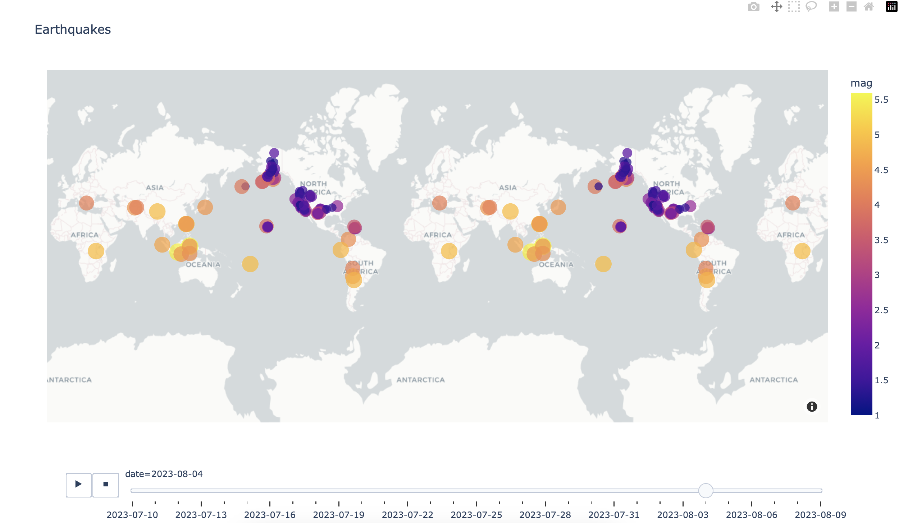

# Earthquake Visualizer

The Earthquake Visualizer is a basic Python project that allows users to visualize earthquake data on a world map. This project is a simple starting point for understanding earthquake data and how to plot it on a map.



## Features

- Fetch earthquake data from a public API.
- Plot earthquake locations on a world map.
- Display earthquake magnitude and location information.
- Basic interactivity to zoom and pan the map.

## Installation

1. Clone the repository:

   ```
   git clone https://github.com/marsha-tiisa/earthquake-visualizer.git
   ```

2. Change directory to the project folder:

   ```
   cd earthquake-visualizer
   ```

3. Install required dependencies:

   ```
   pip3 install pandas
   ```
   ```
   pip3 install plotly
   ```

## Usage

1. Run the application:

   ```
   python app.py
   ```

2. Click play button on your IDE TO open your web browser and see the Earthquake Visualizer in action. Change dates to see seismic activity throughout the world.

## Data Source

This project fetches earthquake data from a public API. The specific data source is (https://earthquake.usgs.gov/earthquakes/feed/v1.0/summary/all_month.csv), and we are using their data to display earthquakes on the map.
